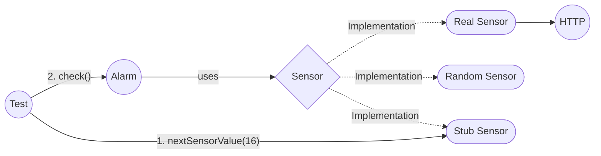

# Tire Pressure

Write the unit tests for the `Alarm` class. The `Alarm` class is designed to monitor tire pressure and set an alarm if the pressure falls outside of the expected range. The `Sensor` class provided for the exercise fakes the behaviour of a real tire sensor, providing random but realistic values.

## The Task

The `Alarm` reads the current pressure via a `Sensor` and triggers if the value is out of range. To make the `Alarm` testable without a real sensor, use a **Stub** that returns a controlled pressure value.



## Acknowledgements

This exercise was originally designed by Luca Minudel and is included in his repo [TDDwithMockObjectsAndDesignPrinciples](https://github.com/lucaminudel/TDDwithMockObjectsAndDesignPrinciples). See also the video: https://youtu.be/ldthYMeXSoI

## Setup

```bash
npm install
npm test
```

## Watch Mode

```bash
npm run test:watch
```
