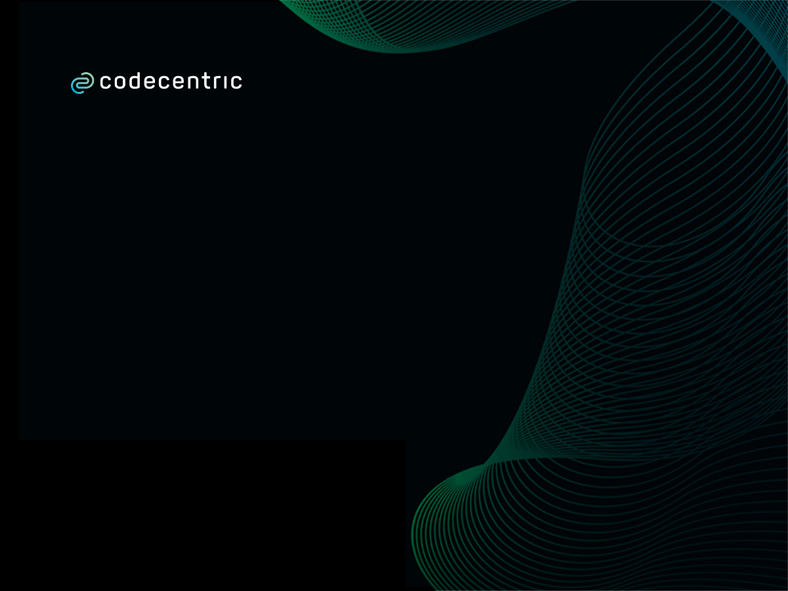
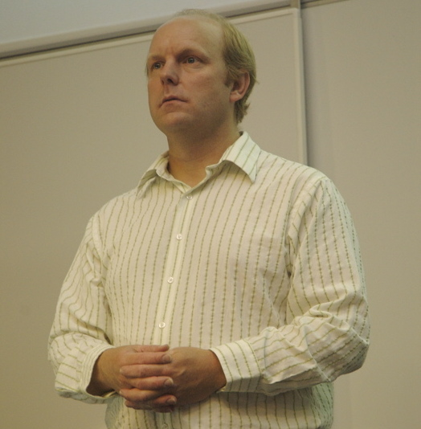

<!-- .slide: data-background-image="images/cc_title_2.jpg" data-background-color="black" -->

<!--  -->

<h3 style="color: white; font-size: 100px; text-transform: none; position: relative; top: -80px; ">
  TDD in JS<br/>
  (Express Version)
</h3>

<p style="position: absolute; top: 495px; right: 280px; color: white; text-transform: none; text-align: right">@MarcoEmrich<br/></p>

Notes:

- skill matrix
- tdd? anyone? -> skip tdd intro?

---

<!-- .slide: data-background="images/typing.jpg" -->

## What is the most

## **time consuming activity**

## in programming?

---

<!-- .slide: data-background="images/wheel_g.jpg" -->

- **A** - New features
- **B** - Refactoring
- **C** - Hunt for bugs

---

<!-- .slide: data-background="images/wheel_g.jpg" -->

- **A** - New features
- **B** - Refactoring
- **C**<!-- .element style="color: red" --> - **Hunt for bugs** <!-- .element style="color: red" -->

---

<!-- .slide: data-background="images/bugfixing.png" data-background-size="contain" data-background-color="white "-->

---

<!-- .slide: data-background="images/chest.png" data-background-size="contain"-->

# Secret

# of

# TDD

## Test Driven Development

---

<!-- .slide: data-background="images/apples.png" -->

# Quality Assurance?

---

<!-- .slide: data-background="images/bees.jpg" -->

# Productivity!

---

<!-- .slide: data-background="images/lab.jpg" -->

# Research!

## Proofen

# Faster **WITH** Tests

---

<!-- .slide: data-background="images/ampel_g.png"  -->

# TDD

## When?

## Who?

---

<!-- .slide: data-background="images/ampel_g.png"  -->

<h3 style="position: absolute; top: 300px; left: 20px">Invented</h3>

## 1957


### John von Neuman

---

<!-- .slide: data-background="images/punch_card.jpg"  -->

---

<!-- .slide: data-background="images/ampel_g.png"  -->

<h3 style="position: absolute; top: 250px; left: 670px">Rediscovered</h3>

## 1989



### Kent Beck

---

<!-- .slide: data-background="images/ampel_g.png"  -->

# 60 Years of TDD

Note: Dieses Jahr feiern wir also 30 Jahre TDD

---

<!-- .slide: data-background="images/yuno.jpg" data-background-size="contain" data-background-color="#2c4762" -->

---

<!-- .slide: data-background="images/hard1.jpg" -->

---

<!-- .slide: data-background="images/ampel_g.png"  -->

<!-- MEME: Y -->

# But Why?

---

<!-- .slide: data-background="images/ampel_gg.png"  -->

> TDD is not about Testing

&mdash; everywhere on the Internet

---

<!-- .slide: data-background="images/design.jpg" -->

# TDD === Design

---

<!-- .slide: data-background="images/docs.jpg" -->

# Tests === Specs

---

<!-- .slide: data-background="images/ampel_gg.png"  -->

## Example

## Leap Year

```javascript
isLeapYear(2000); // => true
```

---

<!-- .slide: data-background="images/ampel_gg.png"  -->

## a bad Test

```javascript
test("testIsLeapYearIsCorrect", () => {
      expect(isLeapYear(2016)).toBeTruthy()
      expect(isLeapYear(2000)).toBeTruthy()
      expect(isLeapYear(3)).toBeFalsy();
      expect(isLeapYear(100)).toBeFalsy();
      ...
}
```

<br/>
<small>from [Structure and Interpretation of Test Cases](https://vimeo.com/289852238) by Kevlin Henney</small>
----
<!-- .slide: data-background="images/ampel_gg.png"  -->

### a Spec Document

<ul class="small">
<li>A year is a leap year if it is divisible by 4 but not by 100</li>
<li>A year is a leap year if it is divisible by 400</li>
<li>A year is NOT a leap year if it is not divisible by 4</li>
<li>A year is NOT a leap year if it is divisible by 100 but not by 400</li>
</ul>
<br/><br/><br/>
<small>from [Structure and Interpretation of Test Cases](https://vimeo.com/289852238) by Kevlin Henney</small>
----
<!-- .slide: data-background="images/ampel_gg.png"  -->

```javascript
test("A year is a leap year if it is divisible by 4 but not by 100", {
  ...
});

test("A year is a leap year if it is divisible by 400", {
  ...
});

test("A year is NOT a leap year if it is not divisible by 4", {
  ...
});

test("A year is NOT a leap year if it is divisible by 100 but not by 400", {
  ...
});

```

---

<!-- .slide: data-background="images/ampel_gg.png"  -->

```javascript
describe("A year is a leap year if", () => {
  it("is divisible by 4 but not by 100", () => {
    expect(isLeapYear(2016)).toBeTruthy();
  });
  it("is divisible by 400", () => {
    expect(isLeapYear(2000)).toBeTruthy();
  });
});
describe("A year is *NOT* a leap year if", () => {
  it("is not divisible by 4", () => {
    expect(isLeapYear(3)).toBeFalsy();
  });
  it("is divisible by 100 but not by 400", () => {
    expect(isLeapYear(100)).toBeFalsy();
  });
});
```

---

<!-- .slide: data-background="images/ampel_g.png"  -->

# Flatten the TDD learning Curve?

---

<!-- .slide: data-background="images/dan_g.jpg" -->

# BDD

## **B**ehaviour **D**riven **D**evelopment

2006 https://dannorth.net/introducing-bdd

---

<!-- .slide: data-background="images/dan_g.jpg"  -->

# Vocabulary

Specs describing behavior

---

<!-- .slide: data-background="images/ampel_g.png"  -->

Ideas from

# BDD

---

<!-- .slide: data-background="images/ampel_g.png"  -->

# BDD-style TDD

## TDD Done Right

---

<!-- .slide: data-background="images/ampel_g.png"  -->

> modern JavaScript-Unit-Test-Frameworks
> are BDD-Frameworks

---


Notes:

ich müsste eigentlich hier oben noch JEST 2017 einfügen - das Jahr seit man es sinnvoll benutzen kann

---

<!-- .slide: data-background="images/ampel_g.png" -->

## String Calculator

## Kata


Roy Osherove

---

<!-- .slide: data-background="images/ampel_g.png" -->

## String Calculator

## Kata

# "1,2,3" => 6

---

<!-- .slide: data-background="images/demo.jpg" -->

## String Calculator

# Exercise

Notes:

- Install Jest
- "test": "jest --watchAll"
- String Calc Kata: 3 First Steps
- Show Jest Docs

---

<!-- .slide: data-background="images/ampel.png" data-background-size="contain" data-background-color="white" -->

---

<!-- .slide: data-background="images/ampel_g.png" -->

# <span style="color: red;">A</span>rrange

# <span style="color: red;">A</span>ct

# <span style="color: red;">A</span>ssert

---

<!-- .slide: data-background="images/docs.jpg" -->

# Living Documentation

---

<!-- .slide: data-background="images/focus.jpg" -->

# Focus

Notes:

Damit ich den Fehler verstehe, darf der Test nur eine Sache tun, Fokus auf SUT

---

<!-- .slide: data-background="images/mouse.jpg" -->

# SUT

### Subject under Test

---

<!-- .slide: data-background="images/isolation.jpg" -->

# Isolation

Notes:

Jest garantiert keine Reihenfolge, Tests dürfen sich nicht beeinflussen
=> Flaky Tests

---

<!-- .slide: data-background="images/babysteps.jpg" -->

# Baby Steps

---

<!-- .slide: data-background="images/ampel_g.png" -->

## Image Credits

<ul class="very-small">
  <li>Typewritter by rawpixel on pixabay, Licence CC0</li>
  <li>Dan North http://dannorth.net/bio/</li>
  <li>Space Image by Gerd Altmann from Pixabay, Licence CC0</li>
  <li>Animal Mouse by Tiburi on Pixabay, CC0</li>
  <li>Punchcard WikiImages on Pixabay, CC0</li>
  <li>London Photo by Luca Micheli on Unsplash, CC0</li>
  <li>Fire Motorcycle Stunt by digihanger on Pixabay, CC0</li>
  <li>Fitness Training by Ichigo121212 from Pixabay, CC0</li>
  <li>Home Office Workstation by Free-Photos on Pixabay, CC0</li>
  <li>Woman Typing by Christina @ wocintechchat.com on Unsplash CC0</li>
  <li>Persson designing by Alvaro Reyes on Unsplash, CC0</li>
  <li>Pairprogramming by Atlassian</li>
  <li>Mob Programming by Sispirate on Wikipedia Commons CC BY-SA 4.0</li>
  <li>Drunken Kermit by Alexas Fotos on Pixabay, CC0</li>
  <li>Skyline Skyscraper by PIRO4D on Pixabay, CC0</li>
  <li>Detroit Photo by Sawyer Bengtson on Unsplash, CC0</li>
  <li>London Photo by Luca Micheli on Unsplash, CC0</li>
  <li>Ship by Lespinas Xavier on Unsplash</li>
  <li>Apples by Raquel Martínez on Unsplash</li>
  <li>Bees Kai Wenzel on Unsplash</li>
  <li>Boxing by Hermes Rivera on Unsplash</li>
  <li>The End by Gerd Altmann by Pixabay </li>
  <li>Architecture by Lance Anderson on Unsplash </li>
</ul>

---

<!-- .slide: data-background="images/ampel_g.png" -->

## Image Credits 2

<ul class="very-small">
  <li>http://www.flickr.com/photos/janodecesare/9069301176/sizes/k/ CC BY-NC-ND 2.0</li>
  <li>http://www.flickr.com/photos/mike_nelson/4723888594/sizes/o/in/photostream/ CC BY 2.0</li>
  <li>http://www.flickr.com/photos/kaptainkobold/3800229848/sizes/o/in/photostream/ CC BY-NC-ND 2.0</li>
  <li>http://www.flickr.com/photos/a_ninjamonkey/3565672226/sizes/o/in/photostream/ CC BY-NC-SA 2.0</li>
  <li>http://www.flickr.com/photos/gisellenw/7683661450/sizes/l/in/photostream/ CC BY 2.0</li>
  <li>http://www.flickr.com/photos/rogersg/3814863064/sizes/l/in/photostream/ CC BY-SA 2.0</li>
  <li>https://www.flickr.com/photos/loufi/3500076/ CC BY 2.0</li>
  <li>http://www.flickr.com/photos/seandreilinger/133305683/sizes/o/in/photostream/ CC BY-NC-SA 2.0</li>
</ul>

---

<!-- .slide: data-background="images/ampel_g.png" -->

## Other Links and Refs

<ul class="small">
  <li>TDD Origin: https://arialdomartini.wordpress.com/2012/07/20/you-wont-believe-how-old-tdd-is</li>
  <li>String Calculator by Roy Osherove: http://osherove.com/tdd-kata-1/</li>
  <li>Studies of TDD: http://biblio.gdinwiddie.com/biblio/StudiesOfTestDrivenDevelopment</li>
  <li>State of JS: https://2018.stateofjs.com/testing/overview/</li>
  <li>TJ. Holowaychuck: https://medium.com/@kelas/how-is-tj-holowaychuk-so-insanely-productive-604818b4e9eb</li>
</ul>

---

<!-- .slide: data-background="images/ampel_g.png" -->

# Q & A


Twitter: @MarcoEmrich

Email: marco.emrich@codecentric.de
