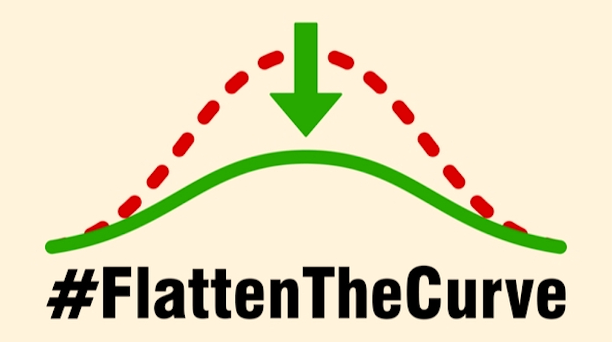
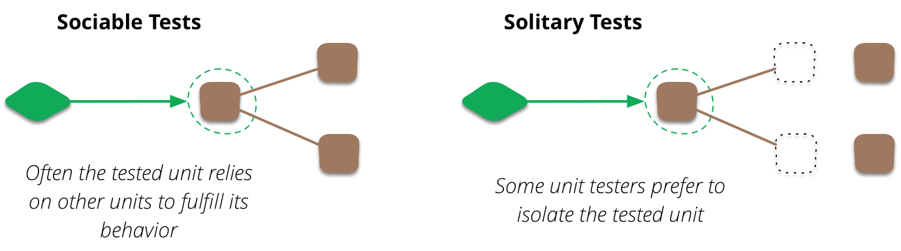

<!-- .slide: data-background-image="images/apples.png"  -->

# Software Quality Assurance

<p style="position: absolute; top: 495px; right: 280px; color: white; text-transform: none; text-align: right">@MarcoEmrich<br/></p>

Notes:

- skill matrix: TDD / Automatisiertes Testen
- tdd? anyone? -> skip tdd intro?
- Fragen vorher:
  - Warum sollte ich im FE automatisiert testen?
  - Was für Schwierigkeiten erwarte ich beim TDD im FE?


----

<!-- .slide: data-background="images/typing.jpg" -->

## Topics

1.  Basics / TDD
1.  Assertions beyond toBe
1.  Test Doubles
1.  UI-Testing

---

<!-- .slide: data-background="images/typing.jpg" -->

What is the most

**time consuming activity**

in programming?

----

<!-- .slide: data-background="images/wheel_g.jpg" -->

- **A** - New features
- **B** - Refactoring
- **C** - Hunt for bugs

----

<!-- .slide: data-background="images/wheel_g.jpg" -->

- **A** - New features
- **B** - Refactoring
- <span>**C** - Hunt for bugs</span> <!-- .element style="color: red" -->

----

<!-- .slide: data-background="images/bugfixing.png" data-background-size="contain" data-background-color="white "-->

----

<!-- .slide: data-background="images/chest.png" data-background-size="contain"-->

# Secret

# of

# TDD

## Test Driven Development

----

<!-- .slide: data-background="images/apples.png" -->

# Quality Assurance?

----

<!-- .slide: data-background="images/bees.jpg" -->

# Productivity!

---

<!-- .slide: data-background="images/lab.jpg" -->

# Research?

----

> The results […] indicate that [...] the resulting quality was higher than teams that adopted a non-TDD
> approach by an order of at least **two times**

&mdash; _Evaluating the Efficacy of Test-Driven Development_

Microsoft Research (2006)

----

> Test-first [...] did increase productivity probably because tests allow for better task understanding, better task focus, faster learning, and lower rework efforts

&mdash; _On the Effectiveness of Test-first Approach to Programming_

Carnegie Mellon University (2005)

---

# TDD

## When?

## Who?

----

<h3 style="position: absolute; top: 300px; left: 20px">Invented</h3>

## 1957


### John von Neuman

----

<!-- .slide: data-background="images/punch_card.jpg"  -->

----

<h3 style="position: absolute; top: 250px; left: 670px">Rediscovered</h3>

## 1989


### Kent Beck

----

# 30 Years of TDD

Note: Dieses Jahr feiern wir also 30 Jahre TDD

----

# ...or 60 ?

---

# First JS TDD-Framework?

----

# 2001 JS Unit


---

<!-- .slide: data-background="images/yuno.jpg" data-background-size="contain" -->

----

<!-- .slide: data-background="images/hard1.jpg" -->

----

<!-- .slide: data-background="images/hard2.jpg" -->

----

<!-- .slide: data-background="images/hard4.jpg"  -->

----

<!-- .slide: data-background="images/learn_tdd.png" data-background-size="contain" data-background-color="white"-->

----

<!-- .slide: data-background="images/fail.jpg"  -->

----

<!-- .slide: data-background="images/fail.jpg"  -->

# Slow

# Hard to Maintain

---

<!-- MEME: Y -->


----

> TDD is not about Testing

&mdash; everywhere on the Internet

----

<!-- .slide: data-background="images/design.jpg" -->

# TDD === Design

----

<!-- .slide: data-background="images/docs.jpg" -->

# Tests === Specs

----

<!-- .slide: data-background="images/docs.jpg" -->

# Living Documentation

----

# Example

## Leap Year

```javascript
isLeapYear(2000); // => true
```

----

### a bad Test

```javascript
test("testIsLeapYearIsCorrect", () => {
      expect(isLeapYear(2016)).toBeTruthy()
      expect(isLeapYear(2000)).toBeTruthy()
      expect(isLeapYear(3)).toBeFalsy();
      expect(isLeapYear(100)).toBeFalsy();
      ...
}
```

<br/>
<small>from [Structure and Interpretation of Test Cases](https://vimeo.com/289852238) by Kevlin Henney</small>
----

### a Spec Document
<ul class="small">
<li>A year is a leap year if it is divisible by 4 but not by 100</li>
<li>A year is a leap year if it is divisible by 400</li>
<li>A year is NOT a leap year if it is not divisible by 4</li>
<li>A year is NOT a leap year if it is divisible by 100 but not by 400</li>
</ul>
<br/><br/><br/>
<small>from [Structure and Interpretation of Test Cases](https://vimeo.com/289852238) by Kevlin Henney</small>

----

```javascript
test("A year is a leap year if it is divisible by 4 but not by 100", {
  ...
});

test("A year is a leap year if it is divisible by 400", {
  ...
});

test("A year is NOT a leap year if it is not divisible by 4", {
  ...
});

test("A year is NOT a leap year if it is divisible by 100 but not by 400", {
  ...
});

```

----

```javascript
describe("A year is a leap year if", () => {
  it("is divisible by 4 but not by 100", () => {
    expect(isLeapYear(2016)).toBeTruthy();
  });
  it("is divisible by 400", () => {
    expect(isLeapYear(2000)).toBeTruthy();
  });
});
describe("A year is *NOT* a leap year if", () => {
  it("is not divisible by 4", () => {
    expect(isLeapYear(3)).toBeFalsy();
  });
  it("is divisible by 100 but not by 400", () => {
    expect(isLeapYear(100)).toBeFalsy();
  });
});
```

---

# Flatten the TDD learning Curve?



----

<!-- .slide: data-background="images/dan.jpg" -->

<span style="font-size: 80px; position: absolute; top: 250px; left: 700px;">Dan North</span>

----

<!-- .slide: data-background="images/dan.jpg" -->

# BDD

## **B**ehaviour **D**riven **D**evelopment

2006 https://dannorth.net/introducing-bdd

----

# Vocabulary

Specs describing behavior

----

# Questions

- Where to start?
- What should I (not) test?
- How to name the test?
- How can tests help me to locate bugs?

----

Ideas from

# BDD

----


> BDD is TDD done right

## &mdash; J.B. Rainsberger

----

# BDD-style TDD

## TDD Done Right <!-- .element: class="fragment"  -->

---
<!-- .slide: data-background="images/tools_dim.jpg"  -->
# Tools


> modern JavaScript-Unit-Test-Frameworks
> are BDD-Frameworks

----


----


----

<!-- .slide: data-background="images/retention2022.png" data-background-size="contain" -->

## [State of JS - Usage](https://2022.stateofjs.com/en-US/libraries/testing/) <!-- .element: style="position: relative; left: -270px; top: 300px"  -->

----

<!-- .slide: data-background="images/ampel_g.png"  -->

## JS Unit-Testing 2023

- ~~Jasmine, Ava, Tape, ...~~
- Mocha / Jest / **Vitest**


----

<!-- .slide: data-background="images/ampel_g.png" -->

## String Calculator

## Kata


Roy Osherove

----

<!-- .slide: data-background="images/ampel_g.png" -->

## String Calculator

## Kata

# "1,2,3" => 6

----

<!-- .slide: data-background="images/katas.jpg" -->

# Katas & Code Retreats

- https://kata-log.rocks
- https://www.coderetreat.org
- https://www.softwerkskammer.org

----

<!-- .slide: data-background="images/demo.jpg" -->

## String Calculator

# => Demo

---

<!-- .slide: data-background="images/ampel.png" data-background-size="contain" data-background-color="white" -->

----

<!-- .slide: data-background="images/ampel_g.png" -->

# <span style="color: red;">A</span>rrange

# <span style="color: red;">A</span>ct

# <span style="color: red;">A</span>ssert

----

<!-- .slide: data-background="images/docs.jpg" -->

# Living Documentation

----

<!-- .slide: data-background="images/universe.jpg" -->

# Explore the Spaces

Notes:

Wenn ein Test fehlschlägt, möchte

## Todo: Space-Bild, bessere Beispiele, Gegenbeispiele zeigen (siehe Kevlins Talk)

```JavaScript
"AYearIsALeapYearIfItIsDivisibleBy4ButNotBy100"

"A year is a leap year if it is divisible by 4 but not by 100"
```

----

<!-- .slide: data-background="images/focus.jpg" -->

# Focus

Notes:

Damit ich den Fehler verstehe, darf der Test nur eine Sache tun, Fokus auf SUT

----

<!-- .slide: data-background="images/mouse.jpg" -->

# SUT

### Subject under Test

----

<!-- .slide: data-background="images/isolation.jpg" -->

# Isolation

Notes:

Jest garantiert keine Reihenfolge, Tests dürfen sich nicht beeinflussen
=> Flaky Tests

----

<!-- .slide: data-background="images/babysteps.jpg" -->

# Baby Steps

---

<!-- .slide: data-background="images/weights.jpg" -->

# Exercise

## String Calculator

----

<!-- .slide: data-background="images/1.png" -->

----

<!-- .slide: data-background="images/2.png" -->


----

<!-- .slide: data-background="images/weights.jpg" -->

# GO !


---

<!-- .slide: data-background="images/tobe.jpg" -->

# to Be

# or<!-- .element: class="fragment"  -->

# to Equal<!-- .element: class="fragment"  -->

# ?

----

<!-- .slide: data-background="images/tobe.jpg" -->

# Assertions / Expectations

----

## to be or to equal

```javascript
const person1 = {
  name: "Schmidt",
  vorname: ["Stefanie", "Adelheit"],
};
const person2 = {
  name: "Schmidt",
  vorname: ["Stefanie", "Adelheit"],
};

expect(person1).toEqual(person2); // => true
expect(person1).toBe(person2); // => false
```

---

<!-- .slide: data-background="images/fire.jpg" -->

# Test Doubles

---

<!-- .slide: data-background="images/fire_dim.jpg" -->

## Test Doubles

- Dummies <span class="fragment">&rarr; Jest:</span><span class="fragment"> SPY, nativ: z.B: {}</span>
- Fakes <span class="fragment">&rarr; Jest:</span><span class="fragment"> SPY, nativ: möglich</span>
- Stubs <span class="fragment">&rarr; Jest:</span><span class="fragment"> SPY, nativ: möglich</span>
- Mocks <span class="fragment">&rarr; Jest:</span><span class="fragment"> SPY, nativ: -</span>
- Spies <span class="fragment">&rarr; Jest:</span><span class="fragment"> SPY, nativ: -</span>

----

<!-- .slide: data-background="images/spy.png" -->

## Jest

### Everyone is a

# Spy

----

<!-- .slide: data-background="images/spy_dim.png" -->

# Jest

- `jest.fn`
- `jest.spyOn`
- `mockReturnValue`
- `mockImplementation`

---

## Sociable vs Solitary\*


<sub>(*) from M. Fowler/ J. Fields</sub>

----

<!-- .slide: data-background="images/backdoor_g.jpg"  -->

<h2 style="position: absolute; top: 300px; left: -160px;" -->Frontdoor<br />vs<br />Backdoor Testing</h2>

----

### Result verification (Frontdoor)

```javascript
expect(add(3, 4)).toEqual(7);
```

### State verification (Frontdoor)

```javascript
deck = new DeckOfCards(31);
deck.addCardOnTop("♥9");
expect(deck.numberOfCards).toEqual(32);
```

### Behavior verification (Backdoor)

```javascript
pushSpy = jest.spyOn(Array.prototype.push);
deck.addCardOnTop("♥9");
expect(pushSpy).toHaveBeenCalledWith("♥9");
```

----

<!-- .slide: data-background="images/demo.jpg" -->

## Parametrized Tests

## Assertions

## Doubles

# => Demo


----

<!-- .slide: data-background="images/weights.jpg" -->

# Exercise

## Alice vs. Bob

---

<!-- .slide: data-background="images/ui_testing.jpg" -->

# UI Testing

----

<!-- .slide: data-background="images/ui_testing_g.jpg" -->

# UI Testing

- UI-Unit Testing
- End-to-End Testing

----

<!-- .slide: data-background="images/fight.jpg" -->

# UI-Unit Testing

## JSDOM / Happy-DOM

## vs

## Browser DOM

----

<!-- .slide: data-background="images/ui_testing_g.jpg" -->

## UI-Unit-Testing

- Testing Library
  - Jest / Mocha / ViTest
  - JSDOM / HappyDOM
  - Testing-Library.com
- Cypress+Storybook Unit-Tests
- Playwright+Storybook Unit-Tests
- [Cypress Component-Tests](https://docs.cypress.io/plugins/directory#Component%20Testing)

----

<!-- .slide: data-background="images/demo.jpg" -->

# => Demo

---

<!-- .slide: data-background="images/end.jpg" -->
# End to End
<br /><br /><br /><br /><br /><br />

----

<!-- .slide: data-background="images/end_dim.jpg" -->
## E2E-Testing Tools
  * ~~Selenium~~ -> Hell NO!!!
  * ~~Puppeteer~~
  * Playwright
  * Cypress

----

<!-- .slide: data-background="images/end_dim.jpg" -->

# End to End

 * Hard to Maintain
 * Smoke-Tests <!-- .element: class="fragment"  -->
 * 2nd Line Of Test Defence <!-- .element: class="fragment"  -->
 * NO MORE Selenium <!-- .element: class="fragment"  -->


----

# Test-Pyramid


by Martin Fowler
https://martinfowler.com/bliki/TestPyramid.html

----

### Updated Test-Pyramid


----

<!-- .slide: data-background="images/weights.jpg" -->

# Exercise

## Cypress: todo MVC

<span style="background-color: white;">https://github.com/marcoemrich/todomvc-cypress-exercise</span>

---

<!-- .slide: data-background="images/architecture.jpg" -->

# Architecture

----

<!-- .slide: data-background="images/architecture_dim.jpg" -->

# Architecture Patterns

- Hexagonal Architecture (Alistair Cockburn)
- Onion Architecture (Jeffrey Palermo)
- Universal Architecture (JB Rainsberger)

---

<!-- .slide: data-background="images/blocks.jpg" -->

# Testing Terms

----

<!-- .slide: data-background="images/blocks_g.jpg" -->

# Types of Tests

## no common terminology

----

<!-- .slide: data-background="images/blocks_g.jpg" -->

## Testing Terms

### By Architecture

- Unit Test
- UI-Unit Test (aka Component Test)
- Service Test (also Component Test)
- Integration Test
- Service Integration Test
- End-to-End Test

----

<!-- .slide: data-background="images/blocks_g.jpg" -->

## Testing Terms

### By Goal

- Acceptance Test / Functional Test
- Smoke Test
- Regression Test
- Story Test
- User Journey Test

----

<!-- .slide: data-background="images/blocks_g.jpg" -->

## Testing Terms

### More...

- Exploratory Testing
- Flaky / Non-Deterministic Test
- Broad vs. Narrow
- ...

----

<!-- .slide: data-background="images/weights.jpg" -->

## Assignment

## Test Strategie

---

## Image Credits

<ul class="very-small">
  <li>Typewritter by rawpixel on pixabay, Licence CC0</li>
  <li>Dan North http://dannorth.net/bio/</li>
  <li>Space Image by Gerd Altmann from Pixabay, Licence CC0</li>
  <li>Animal Mouse by Tiburi on Pixabay, CC0</li>
  <li>Punchcard WikiImages on Pixabay, CC0</li>
  <li>London Photo by Luca Micheli on Unsplash, CC0</li>
  <li>Fire Motorcycle Stunt by digihanger on Pixabay, CC0</li>
  <li>Fitness Training by Ichigo121212 from Pixabay, CC0</li>
  <li>Home Office Workstation by Free-Photos on Pixabay, CC0</li>
  <li>Woman Typing by Christina @ wocintechchat.com on Unsplash CC0</li>
  <li>Persson designing by Alvaro Reyes on Unsplash, CC0</li>
  <li>Pairprogramming by Atlassian</li>
  <li>Mob Programming by Sispirate on Wikipedia Commons CC BY-SA 4.0</li>
  <li>Drunken Kermit by Alexas Fotos on Pixabay, CC0</li>
  <li>Skyline Skyscraper by PIRO4D on Pixabay, CC0</li>
  <li>Detroit Photo by Sawyer Bengtson on Unsplash, CC0</li>
  <li>London Photo by Luca Micheli on Unsplash, CC0</li>
  <li>Ship by Lespinas Xavier on Unsplash</li>
  <li>Apples by Raquel Martínez on Unsplash</li>
  <li>Bees Kai Wenzel on Unsplash</li>
  <li>Boxing by Hermes Rivera on Unsplash</li>
  <li>The End by Gerd Altmann by Pixabay </li>
  <li>Architecture by Lance Anderson on Unsplash </li>
</ul>

----

## Image Credits 2

<ul class="very-small">
  <li>http://www.flickr.com/photos/janodecesare/9069301176/sizes/k/ CC BY-NC-ND 2.0</li>
  <li>http://www.flickr.com/photos/mike_nelson/4723888594/sizes/o/in/photostream/ CC BY 2.0</li>
  <li>http://www.flickr.com/photos/kaptainkobold/3800229848/sizes/o/in/photostream/ CC BY-NC-ND 2.0</li>
  <li>http://www.flickr.com/photos/a_ninjamonkey/3565672226/sizes/o/in/photostream/ CC BY-NC-SA 2.0</li>
  <li>http://www.flickr.com/photos/gisellenw/7683661450/sizes/l/in/photostream/ CC BY 2.0</li>
  <li>http://www.flickr.com/photos/rogersg/3814863064/sizes/l/in/photostream/ CC BY-SA 2.0</li>
  <li>https://www.flickr.com/photos/loufi/3500076/ CC BY 2.0</li>
  <li>http://www.flickr.com/photos/seandreilinger/133305683/sizes/o/in/photostream/ CC BY-NC-SA 2.0</li>
</ul>

----

## Other Links and Refs

<ul class="small">
  <li>TDD Origin: https://arialdomartini.wordpress.com/2012/07/20/you-wont-believe-how-old-tdd-is</li>
  <li>String Calculator by Roy Osherove: http://osherove.com/tdd-kata-1/</li>
  <li>Studies of TDD: http://biblio.gdinwiddie.com/biblio/StudiesOfTestDrivenDevelopment</li>
  <li>State of JS: https://2018.stateofjs.com/testing/overview/</li>
  <li>TJ. Holowaychuck: https://medium.com/@kelas/how-is-tj-holowaychuk-so-insanely-productive-604818b4e9eb</li>
</ul>
