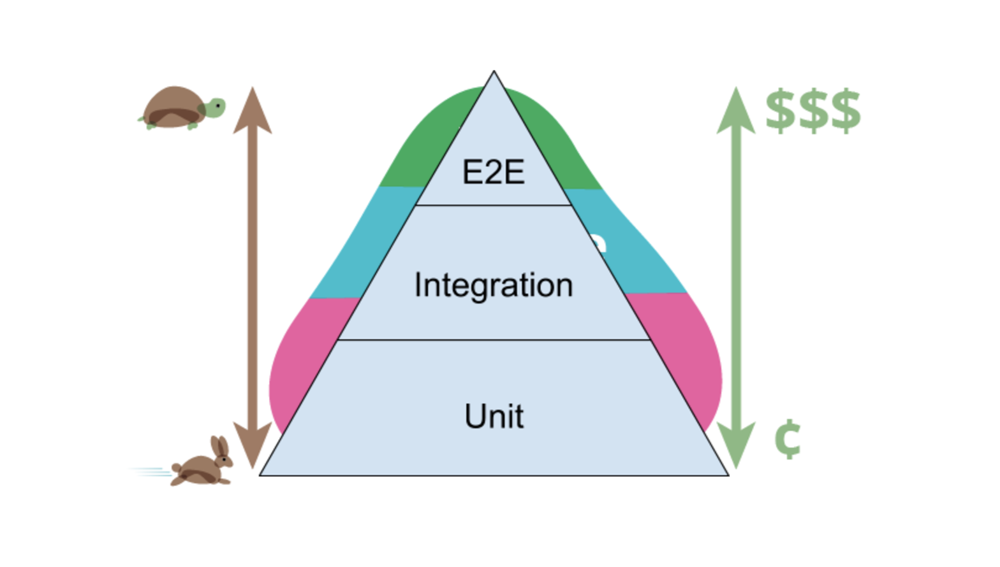

<!-- .slide: data-background-image="images/apples.png"  -->

# Software Quality Assurance
## UI-Testing

---

<!-- .slide: data-background="images/ui_testing.jpg" -->

# UI Testing

----
<!-- .slide: data-background="images/ui_testing_g.jpg" -->

# UI Testing

- UI-Unit Testing
- End-to-End Testing

----
<!-- .slide: data-background="images/fight.jpg" -->

# UI-Unit Testing

## JSDOM / Happy-DOM

## vs

## Browser DOM

----
<!-- .slide: data-background="images/ui_testing_g.jpg" -->

## UI-Unit-Testing

- Testing Library
  - Jest / Mocha / ViTest
  - JSDOM / HappyDOM
  - Testing-Library.com

- Cypress/Playwright +Storybook +Unit-Tests
- Cypress/Playwright Component-Tests

---
<!-- .slide: data-background="images/end.jpg" -->

# End to End
      

----
<!-- .slide: data-background="images/end_dim.jpg" -->

## E2E-Testing Tools
  * ~~Selenium~~ -> Hell NO!!!
  * ~~Puppeteer~~
  * Playwright
  * Cypress

----
<!-- .slide: data-background="images/end_dim.jpg" -->

# End to End

 * Hard to Maintain
 * Smoke-Tests <!-- .element: class="fragment"  -->
 * 2nd Line Of Test Defence <!-- .element: class="fragment"  -->
 * NO MORE Selenium <!-- .element: class="fragment"  -->

----
# Test-Pyramid

by Martin Fowler
https://martinfowler.com/bliki/TestPyramid.html

----
### Updated Test-Pyramid

----
<!-- .slide: data-background="images/weights.jpg" -->

# Exercise

## Cypress: todo MVC

https://github.com/marcoemrich/todomvc-cypress-exercise

---
<!-- .slide: data-background="images/architecture.jpg" -->

# Architecture

----

<!-- .slide: data-background="images/architecture_dim.jpg" -->

# Architecture Patterns

- Hexagonal Architecture (Alistair Cockburn)
- Onion Architecture (Jeffrey Palermo)
- Universal Architecture (JB Rainsberger)

---

<!-- .slide: data-background="images/blocks.jpg" -->

# Testing Terms

----

<!-- .slide: data-background="images/blocks_g.jpg" -->

# Types of Tests

## no common terminology

----

<!-- .slide: data-background="images/blocks_g.jpg" -->

## Testing Terms

### By Architecture

- Unit Test
- UI-Unit Test (aka Component Test)
- Service Test (also Component Test)
- Integration Test
- Service Integration Test
- End-to-End Test

----

<!-- .slide: data-background="images/blocks_g.jpg" -->

## Testing Terms

### By Goal

- Acceptance Test / Functional Test
- Smoke Test
- Regression Test
- Story Test
- User Journey Test

----

<!-- .slide: data-background="images/blocks_g.jpg" -->

## Testing Terms

### More...

- Exploratory Testing
- Flaky / Non-Deterministic Test
- Broad vs. Narrow
- ...

----
<!-- .slide: data-background="images/demo.jpg" -->

# => Demo

---

## Image Credits

<ul class="very-small">
  <li>Typewritter by rawpixel on pixabay, Licence CC0</li>
  <li>Dan North http://dannorth.net/bio/</li>
  <li>Space Image by Gerd Altmann from Pixabay, Licence CC0</li>
  <li>Animal Mouse by Tiburi on Pixabay, CC0</li>
  <li>Punchcard WikiImages on Pixabay, CC0</li>
  <li>London Photo by Luca Micheli on Unsplash, CC0</li>
  <li>Fire Motorcycle Stunt by digihanger on Pixabay, CC0</li>
  <li>Fitness Training by Ichigo121212 from Pixabay, CC0</li>
  <li>Home Office Workstation by Free-Photos on Pixabay, CC0</li>
  <li>Woman Typing by Christina @ wocintechchat.com on Unsplash CC0</li>
  <li>Persson designing by Alvaro Reyes on Unsplash, CC0</li>
  <li>Pairprogramming by Atlassian</li>
  <li>Mob Programming by Sispirate on Wikipedia Commons CC BY-SA 4.0</li>
  <li>Drunken Kermit by Alexas Fotos on Pixabay, CC0</li>
  <li>Skyline Skyscraper by PIRO4D on Pixabay, CC0</li>
  <li>Detroit Photo by Sawyer Bengtson on Unsplash, CC0</li>
  <li>London Photo by Luca Micheli on Unsplash, CC0</li>
  <li>Ship by Lespinas Xavier on Unsplash</li>
  <li>Apples by Raquel Martínez on Unsplash</li>
  <li>Bees Kai Wenzel on Unsplash</li>
  <li>Boxing by Hermes Rivera on Unsplash</li>
  <li>The End by Gerd Altmann by Pixabay </li>
  <li>Architecture by Lance Anderson on Unsplash </li>
</ul>

----

## Image Credits 2

<ul class="very-small">
  <li>http://www.flickr.com/photos/janodecesare/9069301176/sizes/k/ CC BY-NC-ND 2.0</li>
  <li>http://www.flickr.com/photos/mike_nelson/4723888594/sizes/o/in/photostream/ CC BY 2.0</li>
  <li>http://www.flickr.com/photos/kaptainkobold/3800229848/sizes/o/in/photostream/ CC BY-NC-ND 2.0</li>
  <li>http://www.flickr.com/photos/a_ninjamonkey/3565672226/sizes/o/in/photostream/ CC BY-NC-SA 2.0</li>
  <li>http://www.flickr.com/photos/gisellenw/7683661450/sizes/l/in/photostream/ CC BY 2.0</li>
  <li>http://www.flickr.com/photos/rogersg/3814863064/sizes/l/in/photostream/ CC BY-SA 2.0</li>
  <li>https://www.flickr.com/photos/loufi/3500076/ CC BY 2.0</li>
  <li>http://www.flickr.com/photos/seandreilinger/133305683/sizes/o/in/photostream/ CC BY-NC-SA 2.0</li>
</ul>

----

## Other Links and Refs

<ul class="small">
  <li>TDD Origin: https://arialdomartini.wordpress.com/2012/07/20/you-wont-believe-how-old-tdd-is</li>
  <li>String Calculator by Roy Osherove: http://osherove.com/tdd-kata-1/</li>
  <li>Studies of TDD: http://biblio.gdinwiddie.com/biblio/StudiesOfTestDrivenDevelopment</li>
  <li>State of JS: https://2018.stateofjs.com/testing/overview/</li>
  <li>TJ. Holowaychuck: https://medium.com/@kelas/how-is-tj-holowaychuk-so-insanely-productive-604818b4e9eb</li>
</ul>
