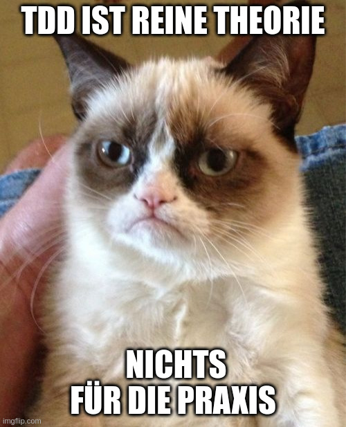
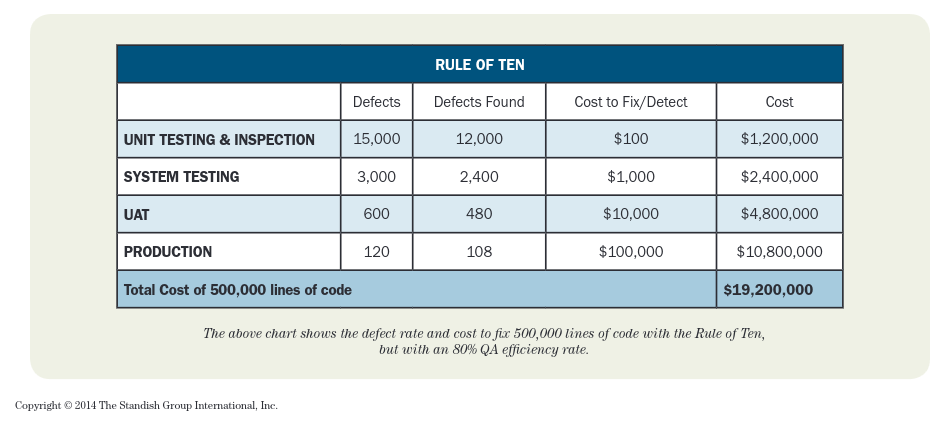
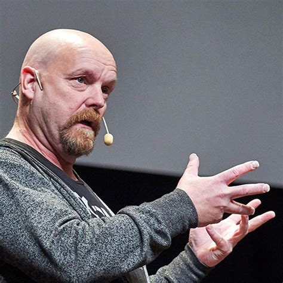
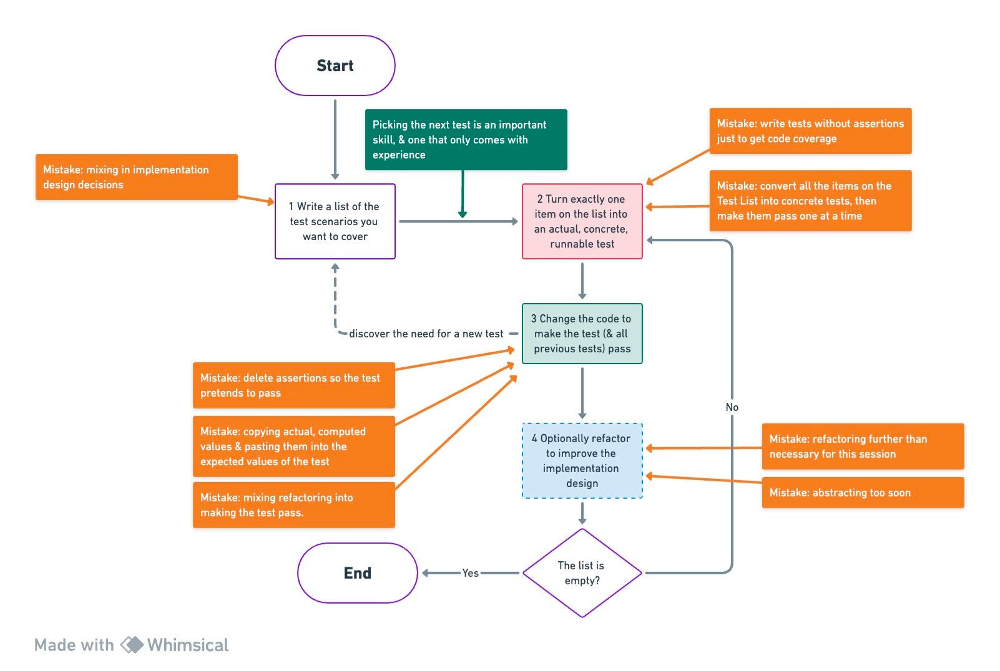

<!-- .slide: data-background-image="images/cc_title_2.jpg" data-background-color="black" -->

<!--  -->

<h3 style="color: white; font-size: 80px; text-transform: none; position: relative; top: -150px; ">
   TDD?<br> Jetzt aber wirklich!
</h2>

<p style="position: relative; top: 20px; right: -10px; color: white; text-transform: none; text-align: right">Marco Emrich<br/></p>

---


<!-- TDD funktioniert bei uns nicht! -->

---


<!-- TDD ist nur Theorie, nichts für die Praxis -->

---
<!-- .slide: data-background="images/meme1.jpg" data-background-size="contain" -->
<!-- Wir haben keine Zeit zum Testen -->

---

# Sounds familiar?

---

<!-- .slide: data-background="images/typing.jpg" -->

## What is the most

## **time consuming activity**

## in programming?

----

<!-- .slide: data-background="images/wheel_g.jpg" -->

- **A** - New features
- **B** - Refactoring
- **C** - Hunt for bugs

----

<!-- .slide: data-background="images/wheel_g.jpg" -->

- **A** - New features
- **B** - Refactoring
- <span>**C - Hunt for bugs**</span> <!-- .element style="color: red" -->

----

<!-- .slide: data-background="images/bugfixing.png" data-background-size="contain" data-background-color="white "-->

----


## Rule of Ten



*(Hans Mulder, Jim Johnson, 2014)*


----

<!-- .slide: data-background="images/chest.png" data-background-size="contain"-->

# Secret

# of

# TDD

## Test Driven Development

----

<!-- .slide: data-background="images/apples.png" -->

# Higher Quality
## No loss of Productivity

---
<!-- .slide: data-background="images/watch.jpg" -->


## Doesn't writing Tests take a lot of time? <!-- .element style="position: relative; top: 400px" -->
# Yes, but... <!-- .element class="fragment" -->

----

<!-- .slide: data-background="images/bughunt.jpg" -->

# Bug Hunting <!-- .element style="position: relative; top: 350px" -->

----
<!-- .slide: data-background="images/dog_pink_glasses.jpg" -->


----

<!-- .slide: data-background="images/lab.jpg" -->

# Research?

----

> The results […] indicate that [...] the resulting quality was higher than teams that adopted a non-TDD
> approach by an order of at least **two times**

&mdash; _Evaluating the Efficacy of Test-Driven Development_

Microsoft Research (2006)

----

> Test-first [...] did increase productivity probably because tests allow for better task understanding, better task focus, faster learning, and lower rework efforts

&mdash; _On the Effectiveness of Test-first Approach to Programming_

Carnegie Mellon University (2005)

---
<!-- .slide: data-background="images/metastudy.jpg" -->

# Meta-Studies
<br><br><br><br><br><br><br><br><br>
---

> Studies in the high rigor and high relevance category ([...]9 studies) show positive results for external quality, and indicate that no difference or negative results are obtained for productivity.


&mdash; _Considering rigor and relevance when evaluating TDD[...]_

Munir, Moayyed, Petersen, Blekinge Institute of Technology, Sweden (2014)


---

<!-- .slide: data-background="images/ampel_g.png"  -->

# TDD

## When?


----

<!-- .slide: data-background="images/ampel_g.png"  -->

<h3 style="position: absolute; top: 300px; left: 20px">Invented</h3>

## 1957


### John von Neuman

----

<!-- .slide: data-background="images/punch_card.jpg"  -->

----

<!-- .slide: data-background="images/ampel_g.png"  -->

<h3 style="position: absolute; top: 250px; left: 670px">Rediscovered</h3>

## 1989



### Kent Beck

----

<!-- .slide: data-background="images/ampel_g.png"  -->

# 30 Years of TDD

Note: Dieses Jahr feiern wir also 30 Jahre TDD

----

<!-- .slide: data-background="images/ampel_g.png"  -->

# ...or 60 ?
---

<!-- .slide: data-background="images/yuno.jpg" data-background-size="contain" -->

----

<!-- .slide: data-background="images/hard1.jpg" -->

----

<!-- .slide: data-background="images/hard2.jpg" -->

----

<!-- .slide: data-background="images/hard4.jpg"  -->

----

<!-- .slide: data-background="images/learn_tdd.png" data-background-size="contain" data-background-color="white"-->

----
<!-- .slide: data-background="images/grumpy.jpg" data-background-size="contain" data-background-color="white"-->

----
<!-- .slide: data-background="images/fail.jpg"  -->


# Fail

----

<!-- .slide: data-background="images/fail.jpg"  -->

# Slow

# Hard to Maintain

---

<!-- MEME: Y -->


----


> TDD is not about Testing

&mdash; everywhere on the Internet
----

<!-- .slide: data-background="images/nottesting.png"  data-background-size="contain" -->


----


> Bullshit, of course it is about testing, but..

&mdash; Kent Beck, 2023


----


> It's not **only** about testing

----

<!-- .slide: data-background="images/design.jpg" -->

# TDD === Design


----
<!-- .slide: data-background="images/dan.jpg" -->


<span style="font-size: 80px; position: absolute; top: 250px; left: 700px;">
Dan North, 2006<br> [Introducting BDD](https://dannorth.net/introducing-bdd)<br/>
</span>

----

<!-- .slide: data-background="images/docs.jpg" -->

# Tests === Specs


----

<!-- .slide: data-background="images/docs.jpg" -->

# Living Documentation

----

# Example

## Leap Year

```javascript
isLeapYear(2000); // => true
```

----

### a bad Test

```javascript
test("testIsLeapYearIsCorrect", () => {
      expect(isLeapYear(2016)).toBeTruthy()
      expect(isLeapYear(2000)).toBeTruthy()
      expect(isLeapYear(3)).toBeFalsy();
      expect(isLeapYear(100)).toBeFalsy();
      ...
}
```

<br/>
<small>from [Structure and Interpretation of Test Cases](https://vimeo.com/289852238) by Kevlin Henney</small>
----

### a Spec Document
<ul class="small">
<li>A year is a leap year if it is divisible by 4 but not by 100</li>
<li>A year is a leap year if it is divisible by 400</li>
<li>A year is NOT a leap year if it is not divisible by 4</li>
<li>A year is NOT a leap year if it is divisible by 100 but not by 400</li>
</ul>
<br/><br/><br/>
<small>from [Structure and Interpretation of Test Cases](https://vimeo.com/289852238) by Kevlin Henney</small>

----

```javascript
test("A year is a leap year if it is divisible by 4 but not by 100", {
  ...
});

test("A year is a leap year if it is divisible by 400", {
  ...
});

test("A year is NOT a leap year if it is not divisible by 4", {
  ...
});

test("A year is NOT a leap year if it is divisible by 100 but not by 400", {
  ...
});

```

----

```javascript
describe("A year is a leap year if", () => {
  it("is divisible by 4 but not by 100", () => {
    expect(isLeapYear(2016)).toBeTruthy();
  });
  it("is divisible by 400", () => {
    expect(isLeapYear(2000)).toBeTruthy();
  });
});
describe("A year is *NOT* a leap year if", () => {
  it("is not divisible by 4", () => {
    expect(isLeapYear(3)).toBeFalsy();
  });
  it("is divisible by 100 but not by 400", () => {
    expect(isLeapYear(100)).toBeFalsy();
  });
});
```

----

<!-- .slide: data-background="images/ampel_g.png" -->

## String Calculator

## Kata


Roy Osherove

----

<!-- .slide: data-background="images/ampel_g.png" -->

## String Calculator

## Kata

# "1,2,3" => 6

----

<!-- .slide: data-background="images/katas.jpg" -->

# Katas & Code Retreats

- https://kata-log.rocks
- https://www.coderetreat.org
- https://www.softwerkskammer.org

----

<!-- .slide: data-background="images/demo.jpg" -->

## String Calculator

# => Demo

---

<!-- .slide: data-background="images/ampel.png" data-background-size="contain" data-background-color="white" -->

----

<!-- .slide: data-background="images/ampel_g.png" -->

# <span style="color: red;">A</span>rrange

# <span style="color: red;">A</span>ct

# <span style="color: red;">A</span>ssert

----

<!-- .slide: data-background="images/docs.jpg" -->

# Specs / Living Documentation

----

<!-- .slide: data-background="images/universe.jpg" -->

# Explore the Spaces

Notes:

Wenn ein Test fehlschlägt, möchte

----

<!-- .slide: data-background="images/universe.jpg" -->


## Explore the Spaces

```JavaScript
AYearIsALeapYearIfItIsDivisibleBy4ButNotBy100

A year is a leap year if it is divisible by 4 but not by 100

A_year_is_a_leap_year_if_it_is_divisible_by_4_but_not_by_100
```

----

<!-- .slide: data-background="images/focus.jpg" -->

# Focus

Notes:

Damit ich den Fehler verstehe, darf der Test nur eine Sache tun, Fokus auf SUT

----

<!-- .slide: data-background="images/mouse.jpg" -->

# SUT

### Subject under Test

----

<!-- .slide: data-background="images/isolation.jpg" -->

# Isolation

Notes:

Jest garantiert keine Reihenfolge, Tests dürfen sich nicht beeinflussen
=> Flaky Tests

----

<!-- .slide: data-background="images/babysteps.jpg" -->

# Baby Steps

---

## Kent Beck's Canon TDD

  1. List of the test scenarios
  *  Turn  one item into a test
  *  Make the test (& all previous tests) pass
  *  Refactor to improve (optional)
  *  Go to #2
---



<small>by [Vic Wu]([ic Wu](https://substack.com/@vicwu)</small>

---

<!-- .slide: data-background="images/weights.jpg" -->

# Exercise

## String Calculator

----

<!-- .slide: data-background="images/1.png" -->

----

<!-- .slide: data-background="images/2.png" -->


----

<!-- .slide: data-background="images/weights.jpg" -->

# GO !


----
<!-- .slide: data-background="images/cat.jpg" -->


> I tried harder but TDD still didn't work for me!

<br><br><br><br><br><br>


----
<!-- .slide: data-background="images/fail.jpg"  -->


# Fail

----

<!-- .slide: data-background="images/fail.jpg"  -->

# Slow

# Hard to Maintain

---
<!-- .slide: data-background="images/fragile.jpg"  -->

# Fragile Tests

http://xunitpatterns.com/Fragile%20Test.html

----
<!-- .slide: data-background="images/ripple.jpg"  -->

## Missing Isolation

 * Defect Localization
 * Ripple Effect


----

<!-- .slide: data-background="images/edna.jpg"  -->

## Possible Solution: Isolation

=> using Stubs, Fakes <!-- .element style="color: black; font-weight: bold;" -->

<br><br><br><br><br><br><br><br>

----
<!-- .slide: data-background="images/overspec.jpg"  -->

## Overspecification

 * caused by Test Doubles
 * caused by too strict Assertions

----
<!-- .slide: data-background="images/relax.jpg"  -->
### Possible Solution

## Relax Assertions

----
## Relax Assertions


```javascript
  expect(foo).toEqual("$129,88");
```
=>

```javascript

  expect(foo).toMatch(/$/d{2,4}[,.]\d\d/);

```
----
## Relax Assertions


```javascript
  expect(foo).toEqual([1, 2, 3, 4]);
```
=>

```javascript

  expect(foo).toContain(3);

```


----
<!-- .slide: data-background="images/mock.jpg"  -->
## Possible Solution

 > Don't mock what you don't own

 &mdash; Steve Freeman

----

<!-- .slide: data-background="images/abstract.jpg"  -->
## Possible Solution


<br>

<ul style="position: relative; left: -300px">
 <li>Less specific tests</li>
 <li>What! Not How!</li>
 <li>Go Up</li>
</ul>


----
<!-- .slide: data-background="images/queen.jpg"  -->

## Possible Solutions
### Delete Tests

 > Off-With-Their-Heads

 &mdash; Markus Gärtner, also Queen of Hearts

Notes:

## Data-Sensitive Tests

 * caused by Shared Fixtures
 * too large context

## Possible Solutions

 * Fresh Fixtures
 * Test Data Builders/Factories

----

<!-- .slide: data-background="images/weights.jpg" -->

# Exercise


----

<!-- .slide: data-background="images/cart.jpg" -->


# The Cart

----


## The Cart

```javascript
Product: {name, price}

cart.addProduct(product, quantity)
cart.show()
```

<pre>
3 Packs of Nails&nbsp;&nbsp;&nbsp;9 €
5 Packs of Screws&nbsp;10 €
------------
8 Items for 19 €
</pre>

---
<!-- .slide: data-background="images/cart.jpg" -->
### small quantity surcharge

```javascript
< 20 € -> 4.95 €
```
---
<!-- .slide: data-background="images/cart.jpg" -->
### small quantity surcharge

```javascript
< 20 € -> 4.95 €
```

### discounts

```javascript
10 € -> 0.5 €
20 € -> 1 €
50 € -> 10 %
```

---
<!-- .slide: data-background="images/cart.jpg" -->
### small quantity surcharge

```javascript
< 20 € -> 4.95 €
```


### discounts

```javascript
10 € -> 0.5 €
20 € -> 1 €
50 € -> 10 %
```

### Gift
```javascript
>= 5 Packs of Screws => add 1 Screwdriver for 0 cost
```

---
<!-- .slide: data-background="images/cart.jpg" -->
### small quantity surcharge

```javascript
< 20 € -> 4.95 €
```


### discounts

```javascript
10 € -> 0.5 €
20 € -> 1 €
50 € -> 10 %
```

### Gift
```javascript
>= 5 Packs of Screws => add 1 Screwdriver for 0 cost
```

### Currency
```javascript
$ , £, €
```


---
<!-- .slide: data-background="images/ampel_g.png" -->

# Q & A


**Email**: marco.emrich@codecentric.de
**LinkedIn**: https://www.linkedin.com/in/marco-emrich-47485388/

---

## Image Credits

<ul class="very-small">
  <li>Typewritter by rawpixel on pixabay, Licence CC0</li>
  <li>Dan North http://dannorth.net/bio/</li>
  <li>Space Image by Gerd Altmann from Pixabay, Licence CC0</li>
  <li>Animal Mouse by Tiburi on Pixabay, CC0</li>
  <li>Punchcard WikiImages on Pixabay, CC0</li>
  <li>London Photo by Luca Micheli on Unsplash, CC0</li>
  <li>Fire Motorcycle Stunt by digihanger on Pixabay, CC0</li>
  <li>Fitness Training by Ichigo121212 from Pixabay, CC0</li>
  <li>Home Office Workstation by Free-Photos on Pixabay, CC0</li>
  <li>Woman Typing by Christina @ wocintechchat.com on Unsplash CC0</li>
  <li>Persson designing by Alvaro Reyes on Unsplash, CC0</li>
  <li>Pairprogramming by Atlassian</li>
  <li>Mob Programming by Sispirate on Wikipedia Commons CC BY-SA 4.0</li>
  <li>Drunken Kermit by Alexas Fotos on Pixabay, CC0</li>
  <li>Skyline Skyscraper by PIRO4D on Pixabay, CC0</li>
  <li>Detroit Photo by Sawyer Bengtson on Unsplash, CC0</li>
  <li>London Photo by Luca Micheli on Unsplash, CC0</li>
  <li>Ship by Lespinas Xavier on Unsplash</li>
  <li>Apples by Raquel Martínez on Unsplash</li>
  <li>Bees Kai Wenzel on Unsplash</li>
  <li>Boxing by Hermes Rivera on Unsplash</li>
  <li>The End by Gerd Altmann by Pixabay </li>
  <li>Architecture by Lance Anderson on Unsplash </li>
</ul>

----

## Image Credits 2

<ul class="very-small">
  <li>http://www.flickr.com/photos/janodecesare/9069301176/sizes/k/ CC BY-NC-ND 2.0</li>
  <li>http://www.flickr.com/photos/mike_nelson/4723888594/sizes/o/in/photostream/ CC BY 2.0</li>
  <li>http://www.flickr.com/photos/kaptainkobold/3800229848/sizes/o/in/photostream/ CC BY-NC-ND 2.0</li>
  <li>http://www.flickr.com/photos/a_ninjamonkey/3565672226/sizes/o/in/photostream/ CC BY-NC-SA 2.0</li>
  <li>http://www.flickr.com/photos/gisellenw/7683661450/sizes/l/in/photostream/ CC BY 2.0</li>
  <li>http://www.flickr.com/photos/rogersg/3814863064/sizes/l/in/photostream/ CC BY-SA 2.0</li>
  <li>https://www.flickr.com/photos/loufi/3500076/ CC BY 2.0</li>
  <li>http://www.flickr.com/photos/seandreilinger/133305683/sizes/o/in/photostream/ CC BY-NC-SA 2.0</li>
</ul>

----

## Other Links and Refs

<ul class="small">
  <li>TDD Origin: https://arialdomartini.wordpress.com/2012/07/20/you-wont-believe-how-old-tdd-is</li>
  <li>String Calculator by Roy Osherove: http://osherove.com/tdd-kata-1/</li>
  <li>Studies of TDD: http://biblio.gdinwiddie.com/biblio/StudiesOfTestDrivenDevelopment</li>
  <li>State of JS: https://2018.stateofjs.com/testing/overview/</li>
  <li>TJ. Holowaychuck: https://medium.com/@kelas/how-is-tj-holowaychuk-so-insanely-productive-604818b4e9eb</li>
</ul>
